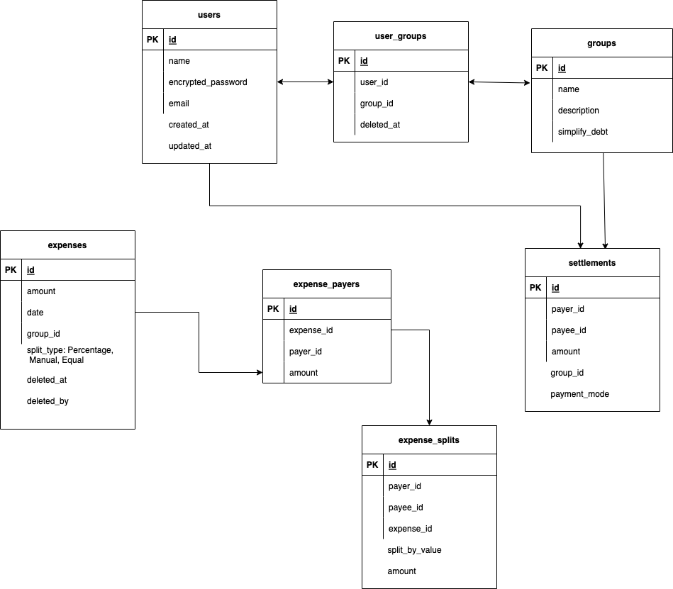

## Database Entity Diagram:

The decision to use RDBMS over No SQL was purely due to the ability to perform complex queries when the data is normalised. 
ExpenseSplits constitutes how each of the expense is split among the groups and since the data is normalised can take advantage of the DB math functions to aggregate data.

